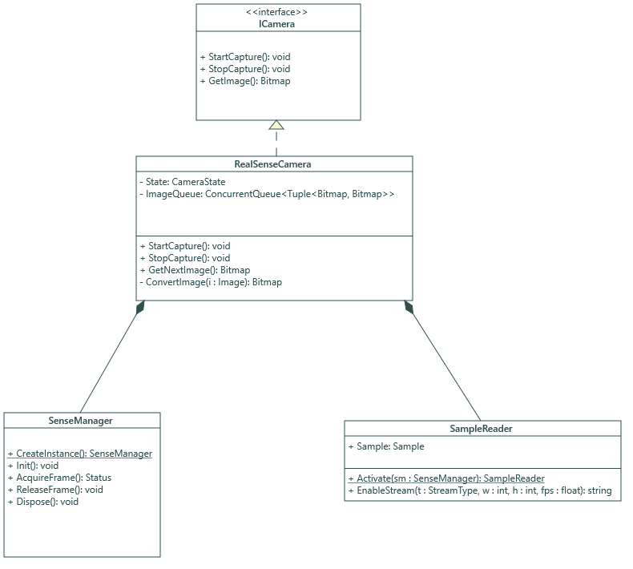
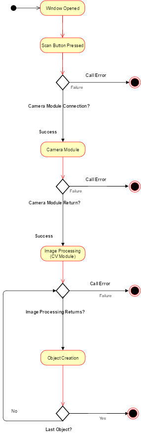

# Executive Summary

The purpose of our project is to create a plugin for the Unity game engine that will allow users to scan simple blocks using an RGB-D camera and have a representation appear in Unity. This project is sponsored by the UCF Games Research Group. This is prototyping tool for video game designers to expedite the process of manually recreating physically-prototyped levels in Unity. Game design students currently create paper/wooden layouts and manually set up each corresponding GameObject in Unity. Our plugin succeeds in being a proof-of-concept for a level-scanning Unity plugin and our code has been written with the intention of future upgrades and functionality being added. 

The scanner is built as a Unity plugin, or package, and coded entirely in C# (targeting Unity's subset of .NET 3.5). It consists of three major modules, the first of which
accepts RGB-D images from sensors, like the Intel RealSense F200, and
processes the data to prepare it for the interpreter. The
interpreter uses this data as input for the second module, a proprietary computer vision system that
will run a color-based detection algorithm to determine the 3D position and type of the objects. The last module will take the information
gathered from the computer vision system and transfer this into a format (GameObject)
that can be ported into Unity. It will then render the
appropriate models in a Unity scene, which can be geometric primitives or custom complex models. The user is able to associate a detected color with a custom 3D model, as long as the model is in a Unity-supported format.

# Overview

## Broader Impact

What we are creating is more than just a tool to build prototypes of
videogame levels. It breaks down many of the barriers of entry to
videogame development, softens the learning curve of game design in
general, and makes game design accessible to a wider audience. One of
the barriers to video game design is the time required to build a game.
To build anything of reasonable complexity, a significant investment of
time is required to both design the level and then implement it. Our
tool aims to consolidate the design and implement stages into a single
step. By doing so designs can be quickly evaluated, modified, and
revaluated to arrive at the best course of action in as little time as
possible. This significantly lowers the barriers of entry to small game
studios and single person teams for creating high quality games. This
tool will allow them to develop higher quality games without requiring
the resources that large game studios have. Our tool also softens the
learning curve for learning how to create videogames. The tool
eliminates the need to learn any new skill to design levels. This allows
individuals who are interested in learning about game design to complete
initial projects faster and more quickly evaluate how they feel about
the field of videogame design in general. Finally, our tool makes game
design more accessible to those who would otherwise not be able to
develop videogames via traditional means. By using blocks to design
levels rather than writing code or using a two-dimensional drag and drop
interface, people with underdeveloped computer skills can engage in
videogame design. This means that young children, elderly, and those
lacking finer motor skills would be able to play levels of their own
creation.

## Personal Motivations

### Brandon Aulet

My initial interest in this project stems from my desire to work in the
gaming industry as a software developer. I have been playing videogames and 
using computers since I was 4 years old. It has had a huge impact on my life,
and was the main reason for my decision to choose this project. The further
that I have gone in my Computer Science degree, the more opportunities I try
to look for to be able to learn about technology that the gaming industry uses.
This project gives me a great chance to learn how to manipulate one of the biggest
game engines in the market today.

I was also excited by the prospect of getting to work with hardware and computer
vision algorithms, things that I have not had much experience with in my time at UCF.
This project gives me the opportunity to expand my knowledge in these fields, making
it more interesting and overall beneficial for my future in and industry by helping
me learn to adapt to different scenarios.

The final reason is that I already had some background in the subject to begin with.
In addition to my Computer Science degree I also pursued a Digital Media minor, during
that time I learned skills that I believed would help me add to this project such as
3D modeling and a general proficiency in using Unity from a game designer's perspective.
That plus the connections I made in my Digital Media classes helped me pick this project
as my first choice.

### Timothy Flowers

I first became interested in working on this project because of the
interest I have had in videogames. Although I have never had a very
strong desire to work in the video game industry, I have always enjoyed
videogames as someone who plays them. When I began my course work as a
Computer Science major, I also began to appreciate them on a technical
level. When I saw the pitch for this project I thought it would be a
great opportunity to exercise both my passions in videogames as well and
technical programming.

Apart from my love for videogames, I’ve also been heavily interested in
graphics. I think the field presents unique programming opportunities
and paradigms that are not often encountered in other areas of computer
science. These opportunities include the usage of highly parallelized
graphics cards as well as the design of shaders which model the behavior
of light when it reflects off different surfaces. I felt like this would
be a good project to further explorer my interest in graphics since
there would be opportunity to process three dimensional models as well
as write an application that interacts with the Unity game engine.

Finally, I found the initial concept of the tool very exciting. When the
implementation is complete, it will allow game designers to eliminate
the need to spend so much time prototyping levels. Our tool should give
them the ability to test an initial concept and then begin to build on
top of it. I get a certain satisfaction at building tools for other
people to use because I feel that in a certain way, I’m responsible for
what people can create with it. To be able to design something that can
help others complete a task much more quickly and efficiently than would
otherwise be possible is what software engineers should always strive to
do.

### Mark McCulloh

Out of all the possible projects the I could choose for senior design, 
I sought after one that provided an interesting outlet for algorithms 
related to computer vision whilst also allowing the project to not be 
especially daunting due to my lack of experience. I know that I will 
fully invest myself in the project if it is interesting and approachable, 
regardless of how I feel about my lack of experience. This project fit that 
bill immediately, but there were even more positives on top of that.

I spend a lot of my leisure time both playing and creating games, so 
it was natural for me to choose a project that integrates with that 
culture and helps others in the same field. The love the idea that I could 
create a tool that students of game development can use to develop their 
skills or simply have fun visualizing their creativity. I have a hope that 
this tool is something that people would actually want to use.

Our project at first seems to lack requirements in a structures way, but 
there is a large open field of possibilities that we can tap into.
I see Senior Design as a way to sharpen my skills as a programmer whilst 
creating something that I can be proud of, and I consider this project as 
a way to accomplish the goals set by my outlook.

### Christopher Williams

I had previously suggested a Senior Design project similar to this, but
utilizing procedural generation techniques. I wanted to assist game
developers in level creation by creating procedurally generated
assets/levels as a tool for the Unity or Unreal Engine. This project
gives the same satisfaction in assisting game developers to increase their
efficiency in level prototyping and will allow me to work with the Unity
Game Engine as I intended.

I had not considered that my experience with Computer Vision could help
with game development and I am excited to apply my experience in this
field and learn much more. I am already familiar with resources for
potential previous implementations of Computer Vision systems in 3D
scene processing and reproduction. I enjoy researching the field of computer vision and hope to write an original implementation for this project alongside Mark.

I have always been enthralled by the game development process and I am excited to have a chance to contribute. My career plans are still an open book at this point in my life and I feel that this project could even open a door to future game development positions. Consisting of both computer vision systems and game development methodologies, this project combines two fields that I am passionate about.

# Specifications

## Goals

Users of Unity will be able to utilize our system turn blocks laid out on a flat surface into untextured unity models, 
each of which are positioned, scaled, and oriented analogous to their real-life counterparts relative to a current Unity scene.
While in Unity, users may initiate a plugin interface to start capturing their proper camera and consequently 
capture images of the real-life block scene. The untextured objects will appear in the scene when the plugin 
concludes its execution.

## Requirements

We have divided up the requirements into two categories: Necessary Features
and Possible Features. Necessary Features contains what is required for our minimal
viable product. Without these, our product is incomplete. Possible Features contains
capabilities we would like for our product to have but are not mandatory for the 
final deliverable.

### Necessary Features

1. The system functions on the Windows platform
2. The system is fully invoked enclosed within the Unity platform
3. The system takes data from pictures taken from within the system
4. The system can interpret a single vertical layer of blocks (minimal occlusion) on a flat surface
5. The system analyses RGB-D data to calculate objects' placements and orientations
6. The system uses object data to create and place models into an established Unity scene

### Possible Features

1. The system has Linux and OSX compatibility
2. The system can take and analyze RGB or RGB-D data
3. The system can interpret multiple vertical layers of blocks on a flat surface
4. The system will have a similar counterpart to work in the Unreal Engine.

# Research

The following section contains the entirety of the research we have conducted thus far.
It includes our research into all of our camera options, multiple computer vision
algorithms for object recognition, and our research into industry standard game engine
plugin models and capabilities.

## Camera Research

The UCF Games Research Group had several devices available to us for no
charge. These included: Intel® RealSense™ F200, Microsoft HoloLens, HTC
Vive, and Microsoft Kinect. The following is an analysis as to the
suitability of each of the devices.

### HTC Vive

The HTC Vive is a virtual reality headset. Although it does have spatial
scanning capabilities, its primary purpose is to immerse the user into 
another reality. This does not make it an ideal device for this task 
since it requires visual presence at all times to place the blocks on the
scanning surface as well as awareness of the environment to perform the
actual scanning of the blocks. The head-mounted nature of the device
is not as easy to aim as a hand-held device. The cost of the device also makes it
prohibitively expensive which is not congruent with the accessibility that
we desired our tool to provide. 

### Microsoft HoloLens

The Microsoft HoloLens is an augmented reality headset that projects
images onto the viewing lens to make it appear as if the images are
sharing the same space as the user. Unlike the HTC Vive, Microsoft
HoloLens does not remove the user from the environment. This allows the
user to stay visually engaged in the environment and move about safely.
The HoloLens also has the added ability of being untethered which allows
for easy movement independent of the location of the device running the
rest of the application. The primary drawbacks to the use of the
Microsoft HoloLens are: battery life, cost, and usability. According to our
sponsors while in use the battery only lasts for approximately two hours and
returning the device to full charge requires approximately five hours. This does not coincide
with our desire to create a tool for rapid prototyping. While the
untethered design is desirable, it does not justify the sacrifice to be
made for battery life. The cost of the device is also prohibitively
expensive. It would not be a resource that could be acquired easily by
small game studios or individual developers. To maintain the
accessibility of our tool a more cost effective device is needed.
Finally, we considered the use of a head mounted device impractical for
our project. The benefit of allowing the user to capture the spatial data
hands free is not significant since the user's hands would have to be 
cleared from the workspace before capture could begin. This means that 
the user cannot perform any actions with their hands while capturing the
data. This makes the hands free capability of any head mounted headset
insignificant for our project.

### Intel® RealSense™ F200

The Intel® RealSense™ F200 camera is a small rectangular camera that could
easily be mounted in a variety of settings. The camera provides the
ability the obtain both color streams and depth streams. Its SDK
includes not only the tools to interface with the device itself, but
also prebuilt algorithms for 3D scanning and other computer vision
applications. The only drawback to the device is that it must be
tethered to the computer via USB. This could make it difficult to
capture all the necessary angles for the construction of the Unity
scene.

#### Possible Implementations

There are four choices of implementation for the Camera module of our
application. They are C\# .NET4, C\# Unity, C\# UWP, and C++. The C++
implementation provides a native interface for the camera and the other
three implementations are wrappers around the C++ implementation. The four
different approaches are described and analyzed below.

##### C\# .NET4

This implementation allows for the .NET4 Framework to interface with the
Intel® RealSense™ F200 camera. We would create a DLL file that provides access
to the data that we wish to retrieve from the camera. This
implementation provides the benefit of allowing me to draw on my
previous .NET development experience. The implementation provides the
benefits of a managed language so no extra time would be spent managing
resources. The primary downsides to this approach would be the
complexity associated with calling an external DLL from Unity, and the
performance loss of using a managed language over a native one. The
additional complexity of using an external DLL should be very minor
since there are only a few points of interaction between the Unity game
engine and the external DLL. The performance loss of using a managed
language should not be of a great concern for this application. The
application is not performing real time data analysis so the need for
the extra performance is not great. The module’s primary responsibility
is to gather data from the camera and possibly do some light
preprocessing. Neither of these tasks are time critical so the need of a
native implementation is not necessary.

##### C\# Unity

This implementation allows the camera module to be written directly into
a Unity Managed Plugin. One of the benefits of implementing the camera module within
the Unity plugin, is the reduction in complexity of the project.
There will not be the need for us to generate an external DLL for the camera module and will
simplify the structure of the project. Another benefit to this approach
is the automatic memory management that a managed language provides.
This reduces the complexity for the programmer, allows for faster
development, and is less likely to introduce common errors such as
memory leaks into the project.

##### C\# UWP

This implementation allows for the Universal Windows Platform to
interface with the Intel® RealSense™ camera. This would involve creating a
UWP app that would interface with the camera and then transfer the image
data to back to Unity as a saved file. The benefit of creating a UWP
application is that the camera module can be run on all variants of
Windows 10. This means that the module could run on phones without any
code changes if necessary. Since there is no benefit to being able to
run the camera application on a phone, the benefits are not useful to
our project.

##### C++

This implementation does not use a wrapper and is a pure native
implementation. This gives the advantage of a boost in performance but
also means that we must handle our own memory management. This module of
the project does require a high level of performance. The camera module
is not required to do any real-time data processing and the amount of
processing that is done in this module is relatively light. The
advantages of a native implementation are not as significant here as
they would be in other applications.

##### Final Decision

For this module, it makes the most sense to use the C\# Unity
implementation. Since C\# is managed, the code required is simpler and
less prone to errors being introduced by the programmer. The lack of
real-time processing in the camera module also means that the negative
performance impacts associated with managed code are reduced. Finally,
since the code is incorporated directly into the Unity plugin, the need
to call an external DLL is eliminated and will make the deployment and
maintenance of the project simpler.

#### Intel® RealSense™ SDK Overview

The Intel® RealSense™ SDK provides access to the camera as well as access
to some computer vision algorithms. Fundamentally the SDK is needed so that 
we can receive the data from the camera and then pass it along to the 
computer vision module. All the following information is available from the
Intel® RealSense™ SDK [@IntelSDK].

##### SenseManager

The `SenseManager` class is the access point for all other modules within the Intel®
RealSense™ SDK. An instance of the `SenseManager` class cannot be created with
a constructor but instead is created with a factory pattern using a static method
of the `SenseManager` class. The primary purpose of the `SenseManager` class is to
create `SampleReader` objects, initiate the data pipeline for processing, and to
control execution of the pipeline. The exact methods required for these functions
in the "Capturing Data" section below.

##### SampleReader

The `SampleReader` class provides access to a stream of color samples, depth 
samples, or both. The sample reader is obtained through a member function
contained within a `SenseManager` object. The type of data that the `SampleReader`
provides is determined by the parameters of a member function call on the
`SampleReader` in question. The `SampleReader` provides properties 
for accessing the sample that the pipeline generates.

##### Scan3D

The `Scan3D` class provides high level access to the 3D Scanning algorithms. 
It acts as an interface to the `PreviewImage` property which displays the current
captured image, as well as the `Reconstruct` method which builds the three 
dimensional object from the acquired frames.

##### Image

The `Image` class provides a means to acquire access to the pixel data of an image as
well as the Image's metadata such as height and width. Its primary elements of interest 
within the `Image` class are the `AcquireAccess` method, `ReleaseAccess` method, and the
`Info` property. The `AcquireAccess` method gives the caller a reference to the underlying 
image data through the use of an `ImageData` object reference. Additional parameters of the
`AcquireAccess` method can also be used to convert the format of the pixel data received. 
The `AcquireAccess` method must be followed by a `ReleaseAccess` method call. The 
`ReleaseAccess` method  allows other callers to acquire access to the image's data. 
The `Info` property of the `Image` is also of importance as it contains the height, 
width, and format of the `Image`.

##### ImageData

The `ImageData` class is comprised of the actual pixel data. It contains several methods
for converting to and from various array types as well as some Unity specific and .NET specific
types. The array types are general enough that they can be used to convert to another type
of image representation if the need arises.

##### Important Enumerations

`FileFormat` is used to specify the file type used by `Scan3D` in the
`Reconstruct` method. There are three supported file types.
  
  * OBJ
  * PLY
  * STL

`ImageAccess` is used to as an argument to specify the access permissions 
when acquiring an `ImageData` object with `AcquireAccess` method. 
  
  * ACCESS_READ
  * ACCESS_WRITE
  * ACCESS_READ_WRITE

`PixelFormat` is used as an argument to specify the format to be 
returned by the `AcquireAccess` method. Some of the formats are
exclusive to a certain type of data such as color, depth, or infrared.
There are several pixel formats.
  
  * PIXEL_FORMAT_YUY2
  * PIXEL_FORMAT_NV12
  * PIXEL_FORMAT_RGB32
  * PIXEL_FORMAT_RGB24
  * PIXEL_FORMAT_Y8
  * PIXEL_FORMAT_Y8_IR_RELATIVE
  * PIXEL_FORMAT_Y16
  * PIXEL_FORMAT_DEPTH
  * PIXEL_FORMAT_DEPTH_RAW
  * PIXEL_FORMAT_DEPTH_F32
  * PIXEL_FORMAT_DEPTH_CONFIDENCE

`StreamType` is used as an argument to specify the type of stream to
a `SampleReader` receives. Some of the stream types are not supported
by all Intel® RealSense™ cameras.

  * STREAM_TYPE_ANY
  * STREAM_TYPE_COLOR
  * STREAM_TYPE_DEPTH
  * STREAM_TYPE_IR
  * STREAM_TYPE_LEFT
  * STREAM_TYPE_RIGHT

##### Capturing Color and Depth Data

The basis of computer vision algorithms is the capture and analysis of 
depth and color data In order to begin capturing depth and/or color data, 
4 steps have to be executed.

1. Acquire the `SenseManager` object by calling the static `SenseManager.CreateInstance` method
2. Acquire a `SampleReader` object by calling the static `SampleReader.Activate` method and passing the acquired `SenseManager` as an argument
3. Call the `EnableStream` method on the acquired `SampleReader` and pass it the type of desired stream
4. Call the `Init` method on the `SenseManager` with no arguments

Once these steps have been completed it is possible to acquire data from
the video pipeline. Acquiring data can be achieved in 3 easy steps

1. Call `AcquireFrame` on the acquired `SenseManager`
2. Retrieve the `Sample` Property from the acquired `SampleReader`
3. Call `ReleaseFrame` on the acquired `SenseManager` when frame processing is complete

The above three steps may be repeated as many times as desired for each frame of 
data to be captured. Upon completion of data capture. The `Close` method 
or `Dispose` method must be called on the acquired `SenseManager`. Use `Close` 
if the `SenseManager` instance will be used to stream data later. 
Otherwise use `Dispose` to free all resources associated with the instance. 

##### 3D Scanning

The Intel® RealSense™ SDK also provides algorithms for scanning 3D objects into
common 3D file formats including: OBJ, STL, and PLY. The use of these algorithms
is made easy through the Intel® RealSense™ SDK and does not require much more
effort than it does to capture raw color and depth. The process is very similar 
to process detailed in the Capturing Color and Depth Data section above. In order 
to scan objects the following steps have to be performed.

1. Acquire the `SenseManager` by calling the static `SenseManager.CreateInstance` method
2. Acquire a `Scan3D` object by calling the static `Scan3D.Activate` method and passing the acquired `SenseManager` as an argument
3. Call the `Init` method on the `SenseManager` with no arguments

This initializes the pipeline for constructing a 3D object. Once the pipeline has 
been initialized the data can begin to be captured. Follow the following steps to 
capture an image.

1. Call `AcquireFrame` on the acquired `SenseManager`
2. Capture the result of the `Scan3D` object's `PreviewImage` method as an `Image` object
3. Call `ReleaseFrame` on the acquired `SenseManager` in order to capture the next frame

The above three steps may be repeated as many times as desired for each frame of 
data to be captured. After all desired frames have been captured. The `Reconstruct` 
method can be called which will save the object with the specified file format and 
file location. Upon completion of data capture and exporting the data to a file, the 
`Close` method  or `Dispose` method must be called on the acquired `SenseManager`. 
Use `Close` if the `SenseManager` instance will be used to stream data later. 
Otherwise use `Dispose` to free all resources associated with the instance. 

##### Dispose Method

Although C\# is a managed language there are some classes in the Intel®
RealSense™ SDK that do not benefit from automatic garbage collection.
These objects include the `SenseManager` class and the `Image` class. 
In order for the object to be processed by the garbage collector, the 
`Dispose` method must be called. In order to ensure that the `Dispose` 
is called, it is wise to place the method call inside of a class 
destructor or to initialize the `SenseManager` in a `using` block.

### Microsoft Kinect

The Microsoft Kinect is a rectangular sensor that can provide both depth
and color data. Much like the Intel® RealSense™ F200 camera, its SDK also
includes prebuilt computer vision algorithms in addition to the standard
camera interface functionality. It also shares the disadvantage of
needing to be tethered via USB to the main computing device. The current
mode of the Microsoft Kinect sensor has the additional disadvantage of needing an
adapter for use with a laptop. This increases the cost of the device as
well as marginally increasing the complexity of the set up for the user.

#### Possible Implementations

The Microsoft Kinect API provides three different types of APIs. It provides 
APIs for the Windows Runtime, .NET Framework, and Native APIs. All three 
APIs use similar naming conventions and therefore skills learned with one 
API should be able to easily transfer to another. The advantages, disadvantages, 
and types of applications that can be written with these APIs are detailed below. 

##### Windows Runtime

The Windows Runtime APIs allow Windows Store Apps that interface with 
the Microsoft Kinect to be written. These APIs can be accessed by any language that
supports the Windows Runtime including C# and Visual Basic. The APIs are 
managed which allow for automatic garbage collection and memory allocation.
Since Windows Store apps have to be distributed through the Windows Store,
we are not interested in this implementation. We want to be able to package 
and distribute our plugin together so having to download one component from
the store and another component from another location is not ideal. We would
also have to communicate the data captured by the Microsoft Kinect to the game 
engine using a localhost loopback or saved file. 

##### .NET Framework

The .NET Framework APIs allow WPF applications to interface with the Microsoft
Kinect. WPF applications are also managed so they carry the same garbage collection
and memory allocation benefits as mentioned in the Windows Runtime APIs. WPF also supports
both C# and Visual Basic. Unlike Windows Runtime applications, WPF applications can 
be distributed easily outside of a storefront. We would still likely have to use the 
same method to transfer data to the game engine.

##### Native APIs
The Native APIs differ from the previous two implementations in that they do not 
include garbage collection or memory allocation. Both of these functions have to 
be explicitly handled by the programmer using the APIs. This can slow down implementation
since extra code has to be written. It would also require additional diligence during 
testing to ensure that there are no memory leaks. The benefit to using the native implementation 
is additional performance but the majority of our computation time is likely to be 
invested in the computer vision algorithms and processing and not the data capture itself.

#### Microsoft Kinect SDK Overview

The following is a brief description of classes from the SDK as they would be useful to 
our project. All the information is available in the Microsoft Kinect SDK Documentation in
Appendix B.

##### KinectSensor

The `KinectSensor` class is used as the primary interface to 
the Microsoft Kinect. The `KinectSensor` adopts a singleton pattern
by using a static method to return an instance of the `KinectSensor` 
class. Once an instance has been obtained all other access to the 
sensor is handled through the instance.

##### DepthFrameSource

The `DepthFrameSource` class gives access to `DepthFrameReader` objects 
through a simple `OpenReader` method. Also includes properties representing
the reliable distances that the Microsoft Kinect can read data.

##### DepthFrameReader

The `DepthFrameReader` class is used to capture `DepthFrame` objects which
represent actual data. The frames can be captured by subscribing an event
handler to the `FrameArrived` member event or by making a call to the `AcquireLatestFrame`
method.

##### DepthFrame

The `DepthFrame` class represents a single moment of depth data capture. The data is represented
as an image where the pixels represent the distance of the given pixel area from the camera. 
It provides methods for accessing the underlying pixel data in both buffer and array forms. 

##### ColorFrameSource

The `ColorFrameSource` class gives access to `ColorFrameReader` objects 
through a simple `OpenReader` method. Also includes properties representing
the reliable distances that the Microsoft Kinect can read data.

##### ColorFrameReader

The `ColorFrameReader` class is used to capture `ColorFrame` objects which
represent actual data. The frames can be captured by subscribing an event
handler to the `FrameArrived` member event or by making a call to the `AcquireLatestFrame`
method.

##### ColorFrame

The `ColorFrame` class represents a single moment of color data capture. The data is represented
as an image where the pixels represent the color of the given pixel area as recorded by the
camera. It provides methods for accessing the underlying pixel data as either a buffer or an
array.

##### Capturing Color and Depth Data

The following steps should be followed in order to initialize the Microsoft Kinect
camera sensor for data collection.

1. Acquire an instance of the `KinectSensor` class by calling `KinectSensor.GetDefault()`
2. Call the `Open()` member method on the acquired `KinectSensor` object
3. Call the `OpenReader()` member method on the acquired `KinectSensor` object's `ColorFrameSource` property to acquire a `ColorFrameReader`
4. Call the `OpenReader()` member method on the acquired `KinectSensor` object's `DepthFrameSource` property to acquire a `DepthFrameReader`

Once the previous steps have been completed the data can begin to be captured from the sensor. Perform
the following steps in order to acquire color and depth data.

1. Call the `AcquireLatestFrame` method on the acquired `ColorFrameReader` to obtain a `ColorFrame`
2. Call the `AcquireLatestFrame` method on the acquired `DepthFrameReader` to obtain a `DepthFrame`

Once the previous steps have been performed the data can be read from the two acquired frames.
Once the processing is complete be sure to call the `Close()` member method on the two acquired frames
to release the system resources. Repeat the previous step as many times as desired. If no more data needs
to be collected, then call the `Close()` member method on both the acquired `ColorFrameReader` and the 
acquired `DepthFrameReader` as well as the acquired `KinectSensor` instance.

### Final Decision

In addition to all of the advantages and disadvantages of each camera device
described above, it is also important to the compare the system requirements. 
Our project team has the computing power to use each of these devices and 
we feel it is also reasonable to assume that game developers would also 
already have devices of this caliber in order to run high performance games. 
Even so all the devices compared have comparable hardware requirements to one 
another and are noted below [@ViveRequirements;@KinectRequirements;@IntelRequirements].

|                 Sensor |                             OS |                                CPU |           Memory |              I/O |               Misc |
|------------------------|--------------------------------|------------------------------------|------------------|------------------|--------------------|
|               HTC Vive |     Win 7 SP1; Win 8.1; Win 10 |             Intel® Core™ i5-4590 < |            4GB < |          USB 2.0 |        Unspecified |
|     Microsoft HoloLens |               N/A (Untethered) |                   N/A (Untethered) | N/A (Untethered) | N/A (Untethered) |   N/A (Untethered) |
| Intel® RealSense™ F200 | Win 8.1(x86/x64); Win 10 (x64) | 4th or 5th Generation Intel® Core™ |      Unspecified |              USB |        Unspecified |
|       Microsoft Kinect |                  Win 8 (x64) < |             i7 3.1 GHz (or higher) | 4 GB (or higher) |          USB 3.0 |         DirectX 11 |

We took the HTC Vive and the Microsoft HoloLens out of consideration because
we did not feel that a head-mounted device fit with the way users would interact 
with our application. Our main decision was choosing between the Intel® RealSense™ 
F200 camera and the Microsoft Kinect. Both sensors had many of the same advantages 
and disadvantages. The differentiating factors between the two was the size
of the sensor, cost of the sensor, and the usability of the APIs. It was in these
areas that the aspects of the devices differed enough for us to make our decision.

The Intel® RealSense™ F200 Camera was marginally cheaper, costing approximately
\$100. This reduced price helps to achieve a greater level of accessibility for our tool
which is an overall goal of our project. By reducing the costs allows for smaller
development teams to expedite their design workflow. The Intel® RealSense™ F200 
also did not require the additional purchase of an adapter for the sensor which 
simplifies the integration for the end user of our tool. 

The handheld usability means that camera can be aimed easily and moved around the 
workspace as needed. Although the USB tethering of the device could make certain 
angles difficult, the use of a rotating platform or a primary computing device 
which can be easily moved, could be used to minimize this difficulty. The use 
of such solutions would allow images to be captured from every angle which is 
necessary for the computer vision algorithms that we will implement to process 
the data. 

Finally, although the APIs were similar we felt that the documentation and 
overall pattern of use found in the Intel® RealSense™ SDK were much more
straightforward and easier to understand. There were also several simple 
code examples to help get programmers who were unfamiliar with the API.

Both the Microsoft Kinect and the Intel® RealSense™ F200 are comparable devices 
and in the unlikely event that the Intel® RealSense™ F200 will not satisfy our 
requirements, the Microsoft Kinect is a sound alternative.

## Computer Vision Research

### Inputs

There are two basic input formats for the incoming camera data: Point
Cloud Data (PCD) or RGB-D image pairs. Point Cloud Data provides
millions of data points which provides an implicit high accuracy level.
The difficulty with Point Cloud Data is that minimization or simplification
would be required before processing if we wish to achieve fast runtimes.

RGB-D image pairs would contain an RGB image alongside a depth image per
frame. This provides a faster runtime more similar to image processing
tasks, but it still provides depth information to make sufficiently
accurate processing results for our purposes. For these reasons we have
chosen to utilize the ability of the Intel® RealSense™ F200 camera to capture
RGB-D image pairs for our application.

The amount of images passed to the computer vision interface is a crucial detail and will take testing to determine the optimal amount of images, angles of view, and capture rate. 

### Outputs

Output from the computer vision interface will mimic the researched methods in the following section. These algorithms output pose information usually in the form of metadata. The metadata for our project will include an estimated object center point in 3D coordinates based on the camera's viewpoint, which is used to estimate a translation matrix. That translation matrix, an object rotation matrix, the object's scale, and a enumerated object type that corresponds with an object model will be outputted to provide sufficient information to add an object to a Unity scene. We plan on importing this data directly into the Unity Game Engine through our plugin interface.

### Training Hardware

Due to the demand required in the training process, our team will be using the strongest 
computer we have available to us. To train our detection algorithm, we will use Mark's personal laptop, which has the specifications listed below.

-------------------------------------------------
    Component   Specification                             
--------------  ---------------------------------
    CPU         Intel® 6th Generation Core i7 

    OS          Windows 10 Pro    

    Display     15.6" FHD (1920x1080), IPS-Level   

    Chipset     Intel® HM170      
    
    Graphics    GeForce® GTX 1060 with 6GB GDDR5 

    Memory      DDR4 16GB      
                              
    Storage     M.2 SSD 128GB and 1TB 5800rpm HDD      

--------------------------------------------------

### Computer Vision Terminology Overview

We will present brief definitions for most of the terms related to computer vision  the average reader may not be familiar with. Please refer back to this section if you encounter unfamiliar terms in the following section.

* 6D or 6DOF - The six degrees of freedom typically used for pose estimation algorithms. These include the x translation, y translation, z translation, x rotation, y rotation, and z rotation. 

* Convolutional Neural Network (CNN) - A CNN is a data structure composed of layers. Each of these layers is composed of individual processing units called neurons which have weights associated with them. The advantage of CNNs over normal neural networks is that they are explicitly designed for image processing. They can handle large images due to their three dimensional structure, the third dimension of which is the depth of the neuron structure not the network itself. The network's layers can be categorized into three basic types: Convolutional layers, Pooling layers, and Fully-Connected Layers.

* Convolution - A convolution in a CNN context is a matrix operation resulting in one scalar value as a result. The dot product of two matricies are computed, one of which is a small matrix called a filter. The result is a single scalar value.

* Convolutional layers - Convolution layers in a CNN are what make this structure special. Each of these layers contains filters that are usually small but deep, extending the full depth of the input data. These filters are convolved with sections of the input data to create a two dimensional list of values called an activation map. This map represents the filter reactions at every point in the input data. Each layer can have many different filters and each filter has its own activation map. These maps are what make up the depth of each layer. These layers do most of the processing work in the network.

* Pooling layer - The job of a pooling layer is to reduce the spatial complexity of the data being passed through the network. The operation these layers perform downsamples the images in the network to reduce the amount of parameters and therefore reduce the processing load on the network.

* Normalization layer - A normalization layer in a CNN is a method of regularization that provides the activations with more of a significant value peak leading to more recognizable local maxima when compared with neighboring values.

* Fully connected layer - A fully connected layer in a CNN is a layer whose neurons are attached to all of the activations of the previous layer rather than a small amount. This makes their activations able to be computed by a matrix multiplication with a bias offset.

* Dropout layer - Dropout layers in a CNN are helpful in training because they reduce the size of the network by having a probability of forcing nodes to drop out of the network. The nodes are reinserted after the network is trained with their original weights. This process cuts down on training time and prevents the model becoming too complex. 

* Energy Function - This is the function that is minimized when computing values in machine learning tasks. You can view this function as a method of inferring whether a value is correct or not. Lower energies are associated with correct values and higher energies are associated with incorrect values.

* Classification problem - Image classification problems are determining if an object in a scene belongs to a set, or one of many sets, of other objects or not. 

* Softmax regression - A method of supervised learning extending logistic regression to multi-class classification problems rather than just binary classification problems.

* Iterative closest point (ICP) - This method of point cloud consolidation keeps one point cloud fixed and matches another source cloud to best match these reference points. Using a cost function, the rotation and translation are estimated and applied to the source points.

* Outlier - An outlier is a value point in a statistical distribution located in the tail.

* Inlier - An inlier is a value point in a mathematical model whose distribution can be explained by the model parameters.

* Random sampling consensus (RANSAC) - RANSAC is a algorithm for estimating parameters of a mathematical model. This will fit the data to a certain model (e.g. line fitting). We will provide an in-depth look at our chosen implementation of RANSAC in the Detailed Design section.

* Kabsch Algorithm - This algorithm calculates the rotation matrix of two sets containing pairs of points such that the root mean squared deviation between the sets is minimized. 

* Decision tree - A decision tree is a tree structure where each node acts as a test of an attribute and every branch is a representation of the outcome of that test. The leaf nodes are labels that indicate which outcome is chosen as the final decision for the tree. These trees can be used as predictive models for machine learning tasks.

* Random forest - A random forest is an ensemble method of machine learning using multiple decision trees usually for classification purposes.

* Gaussian Mixture Model (GMM) - A GMM is a weighted sum of Gaussian statistical distributions. This creates a parameterized probability model of more continuous raw values.  

* Perspective-n-Point - This is a camera localization and camera-pose estimation problem. There are many popular methods for solving this problem using points in a 3D space with their corresponding projections, usually with extended refinement using RANSAC.

### Previous Methods

We have studied many state-of-the-art computer vision methods for 3D
scene processing, object detection, object recognition, and model
alignment. Our goal with this research is to find a method or methods to
adapt for our application that will provide a fast, accurate, and robust
method of processing a 3D scene from our camera and exporting usable
information to the Unity Game Engine to create a template level layout
for the user.

We ensured our search was broad and included as many different methods
as possible to allow for the mitigation of any single method failing or
not satisfying the needs of the user. All of the following methods will
require significant refinement and alteration to meet our needs but will
save us time overall because we will not have to develop a 3D computer
vision algorithm from scratch.

The heart of the problem that this project faces is pose estimation of a rigid object in a 3D scene with six degrees of freedom. This problem can be described as converting the position of a physical object from its own coordinate system to the camera's coordinate system. The important aspects of an object's rotation are defined as its rotation and translation relative to the total coordinate system.

Most of these methods provide bounding-box information as output after
processing. If rotational information is not provided this bounding box
gives us the ability to infer where objects are in the scene and allows
us to convert this information into a 3D box primitive as our input into
the Unity Game Engine. This would work for a physical level built with
only rectangular blocks, but we would like to find a method robust
enough to include other types of blocks such as cylinders, cones, and
pyramids. If a 3D model of the object and sufficient rotational
information is provided we can fit other block types within the bounding-box. With the appropriate rotations applied, this provides a successfully
and robustly matched object in the 3D scene space. Other methods match
pre-existing 3D models to specific data points, typically pixels with object labels associated with them, in the scene provided.

The limitation set by these model-matching methods would be that users
must use these specific types of blocks to get accurate results from our
software. This will satisfy our project requirements, but will not make
a robust system for broader use. A stretch goal would be to implement
more robust methods for alignment that do not rely on pre-existing
models. For now, we will adapt one of the model-alignment methods for
our software and write an implementation in C# for use in a Unity Engine plugin. 
Any of the methods that require 3D models are appropriate
for our purposes because we have been provided 3D models for each of the
block types present in our target block set.

#### Aligning 3D Models to RGB-D Images of Cluttered Scenes

This is a convolutional neural network (CNN) approach to 3D pose recognition with objects from a furniture dataset. The network architecture has 3 convolution layers, 4 normalization layers, 3 rectified linear units, and a dropout layer with a ratio of 0.5. The network is trained for classification with softmax regression loss with the assumption that all objects will be resting on a surface. When testing, the image is propagated forward through the network and the network outputs a pose estimate of an object's orientation [@gupta].

Then this method performs a search on a list of computer-aided design (CAD) models at different scales. Then the model search compares bounding box data given by the CNN output with dimension data from the models. When the correct model and scale is found for an object the rotation and translation are computed by using the iterative closest point (ICP) algorithm. Gravity is computed to restrain ICP to only rotate the furniture models in an upright position [@gupta]. The objects' vertical translation is also assumed to be at floor level which helps with occlusion issues. 

This method provides useful ideas about a potential convolutional neural network approach to our project's computer vision problem. The dataset and model-fitting methods are not applicable to our specific needs, but I believe the neural network approach could be a potentially useful architecture that we may consider for risk mitigation if another structure fails to meet our needs. 

#### Learning 6D Object Pose Estimation using 3D Object Coordinates

This method begins by predicting probabilities and coordinates of object instances using 
a decision forest. An energy function is applied to the output of the forest next. Then, 
optimization is performed using an algorithm based on Random Sample Consensus (RANSAC) [@brachmann2]. 

First, the decision forest is used to classify each pixel of an RGB-D input 
image. Each pixel becomes a leaf node of one of the decision trees in the forest. 
Then a prediction can be made about which object a pixel may belong and where on 
the object it is located. The forests were trained on RGB-D background images with random 
pixels from object images that were already segmented [@brachmann2].

Then, to give each pixel a probability distribution and a coordinate prediction for each tree 
and object, each pixel of an input image is run through every tree in the trained decision forest. 
The result of this is the vectorized results from all leaf nodes in the forest containing probabilities and predictions for each pixel [@brachmann2]. This allows for the prediction of a single pixel belonging to the desired object. If the object was predicted in all of the leaf nodes then its object probability will be calculated.

Pose estimation is calculated by optimizing the energy function in this method. Depth energy, 
coordinate energy, and object energy are calculated and summed to form the total energy for an 
estimated pose. The depth component is an indicator of how much an observed depth differs from 
that of an expected depth of a predefined object at the estimated pose. The other components are 
measures of how much the observed coordinates and object predictions differ from the predicted 
tree values [@brachmann2]. 

Pose sampling is done by choosing three pixels from an integral of the image to increase efficiency. The Kabsch algorithm is used for obtaining object pose hypotheses. A transformation error is calculated for each pose hypothesis using 3D coordinate correspondences. The error for these distances must be under five percent of the target object's diameter. After 210 hypotheses are accepted the best 25 are refined by calculating error for all the trees. If the error distances are within 20 millimeters the pixel is accepted as an inlier [@brachmann2]. 

The inliers' correspondences are saved and used for repeated runs of the Kabsch algorithm until one of three conditions occur. The conditions are as follows: the number of inliers becomes less than three, the error stops decreasing, or the number of iterations exceeds the limit of 100 [@brachmann2].

#### Learning Analysis-by-Synthesis for 6D Pose Estimation in RGB-D Images

This is another convolutional neural network implementation of 6D pose estimation. The network takes 6 modes of input: observed depth, rendered depth, rendered mask, depth mask, object probability, and object coordinates.  For image preparation to use the network this method runs the RGB input image through a random forest and produces the observed probabilities and coordinates based on the forest's modes of output. The probabilities are denoted by grayscale pixel intensity in the outputted image. The images created for object coordinate measures are visualized in RGB and there is one image for every tree in the random forest [@krull]. 

After the random forest process is completed once, the image renders are then passed into the input channels of the convolutional network with the input image's observed depth image. The data is fed through the network and an energy function is calculated. The energy function is then used to calculate the object pose hypothesis. The pose hypothesis transformations are then applied to a 3d model to produce a pair of rendered object coordinate and depth images. These are passed into the CNN and the process repeats until the energy function is at its apparent minimum [@krull].  

#### Uncertainty-Driven 6D Pose Estimation of Objects and Scenes from a Single RGB Image

This paper, which debuted at the 2016 Computer Vision and Pattern
Recognition (CVPR) Conference, by Brachmann *et al.* is currently our
most useful resource for the computer vision interface of our software.
The paper is packaged with source code and extensive documentation which
allows us to study in-depth what their method is accomplishing and how
it functions. This allows us to accurately weigh the benefits and
restrictions of this method in contrast to the other methods reviewed. 
An overview of the method is shown in figure 2, shown below with permission from the author [@brachmann]. 

This algorithm predicts object coordinates and labels with a
modified random forest called a joint classification regression forest. This forest is trained by mapping object coordinates to a smaller set of discrete values using nearest neighbor assignment to the training data's object coordinates randomly. Then those with the most information gain when compared with the object distribution are chosen and these are stored as a Gaussian Mixture Model. When testing an image, a pixel is fed through a tree in the forest and when it gets to a leaf it will store the distribution of object coordinates and predictions for that pixel. Then all of that tree's object predictions are merged to form an overall prediction for that pixel. The coordinate distribution for the tree is then averaged [@brachmann].  

Then Brachmann *et al.* use a stack of these forests to generate context
information for each pixel in the input image. The first level of this stack of forests is trained normally, but all the following trees have access to the outputted information of the previous tree. To smooth the object probability distribution they use a median filter on the pixels surrounding each pixel. This median filter optimizes loss, specifically the least absolute deviations that minimize the difference between hypothesized values and target values, which allows it to be effective when dealing with outlier pixels that would otherwise negatively impact the result. The object coordinates are also regularized using a similar method which optimizes loss[@brachmann].

The object poses are then estimated using RANSAC. When RANSAC is mentioned in this paper it is actually a specific paradigm of RANSAC called preemptive RANSAC which estimates a certain number of hypotheses at once. This paradigm speeds up the normal RANSAC calculation when there are less inliers and many more outliers. Preemptive RANSAC is better for this case since there are always a large amount of outliers, but not too many to find a valid hypothesis. To perform this operation for a single object the forest values of object predictions, pixel positions, and object coordinates are used to estimate the 2D-3D correspondences. Then the reprojection error is calculated and subsequently minimized with the help of a camera matrix. This error is acceptable if it is under a predefined threshold, meaning that this data point is an inlier. The best pose hypothesis is the one in which the largest amount of inliers are found [@brachmann]. The equation from the paper that accomplishes this task is reprinted below with the permission of the author.

Hypotheses are drawn by solving the perspective-n-point problem for four correspondences. The first of four pixels is drawn according to a random tree's mean probability distribution then the other three are drawn within a certain distance of the first pixel depending on the size of the object in question, but if the reprojection error calculated for the pixels is found to be above the threshold then this hypothesis is discarded and a new one is drawn. These hypotheses are sorted by their number of included inliers and the lower half is discarded. The hypotheses left after this process are then further refined by repeating the process of solving the perspective-n-point problem on the new set of inlier value points until only one hypothesis is left. This remaining hypothesis is the estimated pose for the object in question [@brachmann]. 

 When this algorithm is detecting multiple objects at once the above method of detection does not maintain efficiency when a large number of objects are to be detected. Multi-object detections are performed by drawing a shared set of hypotheses instead of individual sets for each object. These hypotheses are chosen by analyzing the object probability distributions at the first pixel of the current hypothesis when performing the same actions as a single-object RANSAC pose estimation. These chosen hypotheses still have to pass the same validity check as in single-object detections. Using this method allows the algorithm to decide if a hypothesis belongs to multiple objects during the hypothesis sampling process instead of having a separate process for each object. This allows their RANSAC pose estimation to scale more easily with a large number of object detections in the same image [@brachmann].

During the pose refinement stage of this implementation they replace the standard error calculation that uses depth information with an error based on the projection volume of a pixel. This is one of the tweaks that allows this method to be extended to RGB images without depth information available. Instead of calculating the log-likelihood of the correspondences observed in a hypothesis using the depth-based error they find the approximate likelihood of the projection volume, as seen in the equation seen below which was reprinted with the author's permission, and take the log-likelihood of that [@brachmann]. Results of some final poses from the Hinterstoisser *et al.* dataset are shown in the paper's figure 4 pictured below, with permission from both Hinterstoisser and Brachmann [@brachmann;@hinterstoisser].

Since source code and documentation were included with this paper we have decided to use it to test the speed and accuracy of this type of pose estimation algorithm. We will test on the smaller dataset included with the source code (dubbed the 'Dummy Data') to ensure that the implementation is functioning correctly. Then it will be trained on the full Asian Conference for Computer Vision (ACCV) object dataset provided by Hinterstoisser *et al.* [@hinterstoisser]. Finally, we will test this algorithm on data we collect with the Intel® RealSense™ F200 camera. We will try to match the performance metrics gathered in this step as closely as possible when we implement a similar algorithm in C#.

### Datasets

#### The RGB-D Object Dataset

This dataset contains 300 objects placed into 51 different categories. It was created with a Microsoft Kinect camera which is very similar to the Intel® RealSense™ F200 camera we plan to use for our application. The RGB frames are captured with width of 640 pixels and height of 480 pixels. The corresponding depth frames are captured at a rate of 30 Hz. The data was captured by recording objects rotating 360 degrees on a spinning table. There is pose-based ground truth data for every object in this dataset. 

This dataset also includes 22 videos of indoor scenes including the objects in the dataset with sufficient cluttering and occlusion for our training purposes. The varying distances in the scenes can help with robust training for different camera setups as well [@rgbdObj].

### The Object Segmentation Database (OSD)

The Object Segmentation Database includes data on 111 objects with corresponding RGB-D data divided into appropriate categories based on their basic shapes. There are categories for boxes, stacked boxes, occlusion, cylindrical objects, mixed objects, and complex scenes. The basic shapes provided could be an excellent resource for testing our algorithm since the blocks provided by our sponsors are the same basic shapes as those included in this database [@osd].

### Willow and Challenge Dataset

The Willow dataset contains 24 series of 353 total RGB-D images with available ground-truth information and separate sets for training and testing. These include 110 objects and 1168 appearances of those objects. 

The Challenge dataset is available alongside the Willow dataset. It includes 39 frame sequences, with 176 RGB-D images total. These include 97 objects with 434 appearances [@willowChallenge].

####  Big Berkeley Instance Recognition Dataset (Big BIRD)

This dataset includes 600 images, 600 RGB-D-based point clouds, pose information for every image and point cloud, segmentation masks for all images, and meshes created from merged point clouds. This dataset is extensive but utilizes point clouds which would not be applicable for our purposes. Although, if extra data is needed, this could be a potentially useful resource [@bigBird].

#### Hinterstoisser *et al.* ACCV Dataset
This dataset was created for a paper presented at the Asian Conference for Computer Vision (ACCV) by Hinterstoisser *et al.*. This dataset contains 15 videos of 15 different objects with texture-less models for matching. There are corresponding ground truth poses for all scenes and objects. There is sufficient variation in clutter, camera angle, camera tilt, scene scale, and object rotation in the scenes for robust pose estimation testing. Every video is comprised of over 1100 images from varying angles [@hinterstoisser]. This dataset is used to test the method presented in "Uncertainty-Driven 6D Pose Estimation of Objects and Scenes from a Single RGB Image" and we would like to test our implementation on this dataset to benchmark test our implementation against the one presented by Brachmann *et al* [@brachmann]. 

## Unity Game Engine Research

### Basic Unity

#### Overview

Unity is a game development engine that permits users to create a variety of games for different
platforms, some of the biggest being PC, Xbox, Playstation, and Android/IOS.  
The base requirements for Unity version 5.5.0 are:

OS: Windows 7 SP1+, 8, 10; Mac OSX 10.8+
GPU: Graphics card with DX9 (shader model 3.0) or DX11 with feature level 9.3 capabilities

#### Scripting

Unity uses an implementation of the Mono runtime for scripting. Mono is an implementation of the 
.NET framework. Mono is sponsored by Microsoft and it follows the ECMA standards for C#.

Unity mainly supports two scripting languages, C# (which is what this project is using) and UnityScript, which is a language that is
modelled after Javascript to use specifically for Unity. Unity can compile the source code 
that is in the "Assets" folder of the project. For other languages, they can be used in Unity scripts
in the form of DLLs, so as long as a language can be compiled into a Dynamically Linked Library(DLL) 
file it can be tied into Unity scripts.

Unity's GameObjects are controlled by Components that are attached to them, and scripts allow
the user to create these Components and manipulate them dynamically. Unity's GUI allows for 
a simple script creation by going to Assets -> Create -> C# Script or Assets -> Create -> Javascript.
This will create a class following your naming convention that extends MonoBehaviour and has two
methods already created, `void Start()` and `void Update()`.

The extension of MonoBehavior is necessary to allow the script to interface with Unity.
It contains the necessary classes to allow for the created script to affect the GameObjects in Unity.
It also gives the class access to the functions that determine when the script is called (like start and 
update). The `Start()` method is called by Unity when the script is initialized, whereas the `Update()`
method is called by Unity on every frame of the game. [@unityScripts]

#### 3D Models

Unity has two kinds of file that it can use to import 3D models. The first is exported 3D file formats and the second is application files from 3D Editors.

The exported 3D file formats that Unity uses are: .FBX, .dxf, .obj, .3DS, and .dae. The 
benefit to these kinds of files are that they tend to be smaller than the application files
and export only the data you will be using. These types of files are  more generalized and are more easily generated programmatically due to them not being proprietary to a certain piece of premium software. 

The applications that unity accepts files from are: Blender, Cinema4D, Cheetah3D, Lightwave,
Maya, Max, and Modo. These kind of files tend to be simpler in terms of usability, especially
since Unity will re-import the model every time the user saves the file. But they also tend to be larger when compared with exported files due to data bloating which is commonly found within 3D modeling software, which can cause a slowdown of Unity. The proprietary software used to create the file must also be owned and licensed on the computer in which it's being used. 

Unity itself has support for simple models to be created through the editor. In the main editor screen, the user can go to Create -> 3D Objects and choose from a list of different simple 3D objects such as cubes or cylinders. Unity will then spawn the object, typically at world coordinates (0, 0, 0), and the user can edit them.

Unity also also has support for dynamic Mesh creation.

The file format for 3D models we have chosen to use for our project in the Unity Engine is the .obj format mentioned previously. This format was chosen due to some key advantages such as the ability to generate the file programatically if it is found to be necessary. The .obj file specification is also publicly available and allows us to construct .obj files from scratch. The four types of vertex types are geometric vertices (`v`), texture vertices (`vt`), vertex normals (`vn`), and parameter space vertices (`vp`) [@obj]. 

The following are proper syntax examples in the .obj file format:

`v x y z w`  for a geometric vertex, where `x`, `y`, and `z` are coordinates of a vertex and `w` is a weight for curves defaulted to one.

`vp u v w` for a freeform geometry, where `u` is either a coordinate of a curve or the first coordinate of a surface. `v` is the second coordinate of a surface. `w` is a curve trimming weight defaulted to one.

`vn i j k` for a normal vertex, where `i`, `j`, and `k` are the normal vector components.

`vt u v w` for a texture vertex, where `u` is the horizontal direction, `v` is the vertical direction , and `w` is the depth. Depending on the dimensionality of the texture, `u` and `v` may be 0.

Syntax for different geometric elements are as follows:

`p v1 v2 ... vn` for a point, where `vn` represents the nth vertex which will create the nth point.

`l v1/vt1 v2/vt2 ... vn/vtn` for a line, where `vn/vtn` represents the nth vertex on the line separated from the texture vertex with a `/`.

`f v1/vt1/vn1 v2/vt2/vn2 ... vn/vtn/vnn` for a face, where `vn/vtn/vnn` represents the nth vertex, texture vertex, and normal vertex respectively.

`curv u0 u1 v1 v2 ... vn` for a curve, where `u0` is a float representing the starting parameter value for the curve, `u1` is a float representing the ending parameter value for the curve, and `vn` represents the nth control point parameter vertex for the curve (there must be at least two).

`curv2 vp1 ... vpn` for a 2D curve, where `vpn` is the nth control point parameter vertices.

`surf s0 s1 t0 t1 v1/vt1/vn1 ... vn/vtn/vnn` for a surface, where `s0` is the start parameter value for the u direction, `s1` is the end parameter value for the u direction, `t0` is the start parameter value for the v direction, `t1` is the end parameter value for the v direction and `vn/vtn/vnn` is the nth control vertex with the nth texture vertex and normal vertex separated by a `/` [@obj].

#### Asset Store

Unity has an Asset Store where users can put any plugins that they create to be sold to other Unity users.
It contains thousands of plugins and other assets created by thousands of users for use in a large amount of game types.
From 3D to 2D, controls, sprites, models, and more it can all be found on the Unity asset store. some
of these assets are free for anyone's use and others have to be paid for. Any Unity user with an account
can have their assets looked at by a Unity Assets Store team and then placed on the asset store for purchase.

### Plugin types

#### Managed Plugins

Managed plugins are a type of plugin that Unity supports which allows
Unity to use C# code that has been created by a third party to supplement
created code. It allows for a community to form around Unity that continuously
builds additional functionality allowing users to create better products. Many Unity users eventually
will place their managed plugins on the Unity Asset store for others to buy and then use/improve on for
their needs.

Unity allows for any C# files in a folder labeled "plugins" under the Assets folder
to be considered a plugin, the files in that folder will be included with every C# script that the user creates, allowing
access to the methods.

Managed plugins can also be implemented through the usage of Dynamically Linked Libraries (DLLs).
This allows a user to take C# code and compile it through a different compiler into a DLL,
then the user can place the DLL into a unity plugin folder to be used in their scripts. from
there the DLLs can be used in the same way that normal C# scripts are used in Unity. [@unityManaged]

#### Native Plugins

Native plugins are libraries of native code that is written in any language that is not directly
compiled by Unity, that can also be compiled into a DLL (Windows). The process of placing the 
Native Plugin into the project is the same as Managed Plugins, you create a folder titled "plugins"
located under the Assets folder and drop the DLLs in there.

To access the methods or functions from the DLL files the user must add tags on the 
C# method used to call the DLL method. First you import the plugin, then you can declare 
the external method using the extern modifier to mark it as an external function:

`[DllImport ("PluginName")]`

`private static extern pFunction();`

The user can then use the declared method to make a call to the native method/function from the
DLL. It should be noted that when creating Native Plugins using C++ or Objective-C, there must be
steps taken to avoid name mangling issues, because plugin functions use a C-based call 
interface.

Any version of Unity that is below 5 requires either a Unity Pro License or a Unity Enterprise License
to be able to use Native Plugins. Unity 5, however, allows all versions to use Native Plugins, from
the Personal version to the Enterprise Version. [@unityNative]

#### Extending the Editor (Maybe change this part's location)

Similarly to how plugins can be made for game logic in Unity, one could also create plugins to extends
the Unity editor itself to make game functionality easier. In fact, one might say that is the entire
purpose of this project. To extend the editor, a script needs to be created where the class extends
EditorWindow. This script will create a new editor window  

### Version Differences and Pricing

| Features      | Personal      | Plus      | Pro       | Enterprise        |
|:-------------:|:-------------:|:---------:|:---------:|:-----------------:|
| All Engine Features | Y       |     Y     |     Y     |        Y          |
| All Platforms |       Y       |     Y     |     Y     |        Y          |
| Continuous Updates|   Y       |     Y     |     Y     |        Y          |
| Royalty Free  |       Y       |     Y     |     Y     |        Y          |
| Splash Screen |       Y       | Custom    |   Custom  |     Custom        |
| Revenue Capacity |    $100k   |   $200k   | Unlimited |    Unlimited      |
| Unity Cloud Build| Standard Queue | Priority Queue | Concurrent Builds | Dedicated Build Agents|
| Unity Analytics | Personal Analytics | Plus Analytics | Pro Analytics | Custom Analytics|
| Unity Multiplayer | 20 Concurrent Users | 50 Concurrent Users | 200 Concurrent Users | Custom Multiplayer|
| Unity Ads     |       Y       |     Y     |     Y     |        Y          |
| Beta Access   |       Y       |     Y     |     Y     |        Y          |
| Pro Editor UI Skin | N |Y | Y | Y|
| Performance Reporting | N | Y | Y | Y |
| Flexible Seat Management | N | Y | Y | Y |
| Asset Kits | N | 20% Off | 40% off | 40% off |
| Unity Certification Courseware | N | 1 Month Access | 3 Month Access | 3 Month Access|
| Source Code Access | N | N | $ | $ |
| Premium Support | N | N | $ | $ |

[@unityTable]

#### Unity free

Unity Free is the base version of Unity that anyone can download from their website at
www.unity3d.com. The base requirements for Unity version 5.5.0 are:

OS: Windows 7 SP1+, 8, 10; Mac OSX 10.8+
GPU: Graphics card with DX9 (shader model 3.0) or DX11 with feature level 9.3 capabilities

Unity's base edition is different from the other editions in a variety of ways. 
Any game created in it automatically has a short splash screen video play at the beginning 
of any game when it is launched depicting the Unity logo with the words "Personal Edition" under
the logo.

Unity personal comes with a $100k revenue capacity. What that means is that if an entity uses Unity
personal to create their game and then sells it, if the game makes more than $100,000 dollars in annual 
gross revenue, that entity must sign up for either the Plus, Pro, or Enterprise edition of Unity. If they do not, then
they are not allowed to use Unity anymore. They may still sell the game which made them that money, but
they are no longer allowed to update or expand that game at all, or make any new games using Unity.

The personal edition also comes with the Unity Cloud Build feature, it allows developers to instantly
compile, test, and deploy the game builds to everyone that needs it. The standard queue processes the
builds in FIFO form across all Unity customers.

Unity Analytics is a feature that allows game developers seamlessly view information about their game
like how it's being used, general gameplay behaviors, and it comes with a money optimization feature.
It comes with Unity IAP, which allows users to set up In-App Purchases within their game and keep track
of it across all platforms. [@unityTable]

#### Unity Plus

Unity Plus is the version of Unity that is one level above the personal edition. It costs $35 per
person per month and comes with upgraded features.

The first upgraded feature is the splash screen. The Plus edition allows users to either use the normal
Unity splash screen, create their own splash screen and insert it into where the Unity splash screen
would be, or elect to not use a splash screen at all.

The Plus edition also upgrades the revenue capacity by $100k extra, allowing users to make an annual
gross revenue of $200k before they are required to either subscribe for Unity Pro Edition or Unity
Enterprise Edition.

The Unity Cloud Build feature is also improved in the plus version, it gives the user a Priority Queue
allowing their builds to be compiled, tested, and deployed faster than the personal version queue.

Unity Plus gives users access to all the features in Unity Analytics that the personal version users have,
but also gives Priority Analytics, livestream support, and more specific analysis of the game data.

Unity Plus also comes with a dark theme called the Pro Editor UI theme which is not available for the
personal version.

Performance reporting is a feature that is only available in Unity Plus and above. It allows users to
view bugs and errors in all of their Unity builds across all platforms, it prioritizes issues as they
are reported in realtime.

Another feature that Unity Plus has is Flexible Seat Management, this allows a moderator/manager of the
entity or team that uses Unity to control what person on the team uses Unity and how they use it.

Another thing that having a Plus subscription gives users is a 20% discount in the Unity Assets Store, 
plus one months access to Unity's Certification Program. [@unityTable]

#### Unity Pro

Unity Pro edition is the next tier of Unity above the Unity Plus Edition. It costs $125 per person per month
and upgrades the features even more than Unity Plus does. Unity pro contains all of the features that the
previous two have, with some upgrades.

Unity Pro edition has no limit on revenue like the previous versions. Anyone who is subscribed to the pro
version can make any Unity game and does not have to change their subscription based on how much they make.
This is most likely because Unity Pro is the highest tier of Unity that a single person can buy.

The Unity Cloud feature is upgraded further from the Plus Unity Cloud feature. It still contains the 
Priority Queue allowing the user to have a faster build time than the Personal users, but it also allows
for creating multiple parallel builds for any project.

Unity Analytics comes with the Unity Pro Analytics feature. It has all that plus has with 50 gigabytes of
raw data export. It also has even more game data analysis than the plus version.

The Assets Store discount is upped in Pro to 40% from the 20% that is discounted in Plus. The Unity
Certification Course access is extended to 3 months. [@unityTable]

#### Unity Enterprise

Unity's Enterprise edition is somewhat of a mix of the previous versions. It allows businesses to make
a customized plan for all of their workers that need Unity to give those who need specific versions 
exactly what they need. This also gives the business access to special Enterprise features.

In the Enterprise tier, Unity will build a custom Unity Cloud infrastructure to give the business a 
queue time that only includes the users in that business.

The Unity Analytics feature is also upgraded in the Enterprise tier to a level that is configurable by the
business. It has all the features of Pro with a custom raw data export size and a custom analysis. [@unityTable]

## Unreal Engine 4 Research

Unity is the primary target of our project, but the Unreal Engine is similar target 
that may serve as an additional implementation path.
The Unreal Engine has recently changed into a free-to-use model, with a royalty needed if 
the profits exceed three thousand dollars per quarter. This is important to note for our 
project because of the implications for educational use. With that in mind, we will 
describe the process of creating a similar implementation of our project in 
the Unreal Engine.

### Plugin System
Unlike Unity, Unreal plugins operate on a relatively separate layer of engine itself. The 
support documentation for the system is also sparse, due to the relatively new implementation 
of the system (2015).

Unreal uses C++ within its environment to do programming, and the same goes for the plugin system.
For the most part, plugin source file layout is the same as any other C++ module in Unreal Engine. 
The Primary addition is a .uplugin file that acts as a descriptor for the plugin. 

#### Descriptors

Plugin descriptors are files that end in a .uplugin extension that are formatted like JSON. one should 
refer to the following two tables to create a proper plugin description couple with a proper module description.

Descriptor File Format [@unreal:plugins]

Module Descriptors [@unreal:plugins]

#### Plugin Code

The process for developing our plugin in Unreal will be very similar to the process in Unity, because we will 
be linking a DLL from within the plugin to provide the necessary functions to access hardware and do the 
computation algorithms. To start the process, every plugin will start with the following two steps:

1. Duplicate the template plugin folder structure given by Unreal.
2. Modify the Plugin and Module Descriptors to match the new plugin.

#### DLL Import
With a blank plugin set up, it is pertinent to note the means by which one loads a DLL into the plugin.
You will need a minimum of three things:

1.  The DLL itself
2.  The .h header file that declares all the functions of the DLL that you can call
3.  The .lib file or import library which contains address of the header file functions in the DLL

Once those files are collected and placed in the project, once has to follow the next three steps to use the functions in 
the DLL:

1.  In the build.cs, add the following lines:

`PublicDelayLoadDLLs.Add("FreeImage.dll");`

`PublicAdditionalLibraries.Add(Path.Combine(FreeImageDirectory, "FreeImage.lib"));`

2.  In the main cpp file for the plugin, add the following:

`DLLHandle = FPlatformProcess::GetDllHandle(*Path);`

After all that, just include the header in any file in the plugin and call any of the DLL functions.

# Detailed Design

## Camera Design

The design of the camera module strives to implement the fundamental 
concept of separating interface from implementation. By defining an
`ICamera` interface that handles all public access, the underlying 
implementation can change dramatically as long as it conforms to the 
contract specified by the interface. This allows for supporting additional
cameras in future versions of the product as well as making camera changes
should unforeseeable events occur. All these changes can happen within
the camera module without the unity plugin needing to change its method
calls at all.

### ICamera Public Members
The `RealSenseCamera` has three public members. All three of its public 
members are implementations of the `ICamera` interface's public members 
They include: `StartCapture()`, `StopCapture()`, and `GetImages()`. 
Each of these public members are described below.

#### StartCapture
The `StartCapture` method of the `RealSenseCamera` signals the class 
to start capturing images from the Intel® RealSense™ F200 Camera. This updates
the camera's state variable to the `CameraState.RUNNING` state. The method
will engage the camera capture loop which will continually capture images 
until otherwise notified. This notification is created by calling the 
`StopCapture` method described below.

#### StopCapture
The `StopCapture` method of the `RealSenseCamera` signals the class
to stop capturing images from the Intel® RealSense™ F200 Camera. The `State`
member variable will be changed in order to signal to the capture loop
to terminate. The camera module will then finish converting and saving
all images that have been captured. Image capture will not resume again 
until the `StartCapture` method has been called.

#### GetImage
Gets the next available image from the camera as a `Bitmap`. 
If an image is available, it will be returned. Otherwise, the
function will block if the `Status` member equals `CameraStatus.RUNNING`
and return the next available image once it becomes available. 
If the `Status` member equals `CameraStatus.STOPPED`, the 
method will return `null` to signal that there are no available
images.

### Concurrency
The ICamera Interface should be able to return a `Bitmap` image while still 
capturing data. This will be accomplished by placing captured images into a 
`ConcurrentQueue<Bitmap>`. When the queue reaches a certain capacity the remaining
captured images will be written to a disk. As the `ConcurrentQueue<Bitmap>` empties 
the images will be read from disk and loaded back into the queue. In order to accomplish
this concurrency, two threads will be needed. One thread will be used to produce
data. The other thread will belong to the caller of the `GetImage` method and
will be used to dequeue the next image, by blocking if necessary, and serve it the caller. 
The only resource shared between the two threads are the `ConcurrentQueue<Bitmap>` which
will account for synchronization issues between the two.

## Computer Vision Design

### Accord.NET Framework

The Accord.NET framework is a machine learning framework written in C# for signal processing, statistics, computer audition, and computer vision applications. Accord.NET extends AForge.NET which is another popular C# machine learning framework, but Accord adds extra scientific computing features. 

The libraries available in the Accord.NET framework are divided into three sections: scientific computing, signal and image processing, and support libraries. One primary namespace we will be using is `Accord.MachineLearning` for `DecisionTrees`, `GaussianMixtureModel` and the RANSAC implementation included [@accord].

 Another useful namespace for this project is `Accord.Math` for integration techniques among other mathematical implementations that will prove useful for calculating loss minimization, refining the RANSAC pose estimation, and any other mathematical equations we incorporate into our implementation [@accord]. 

 The `Accord.Neuro` is useful for any neural network structures. The visualization features of Accord can be used during testing, benchmarking, and development of our implementation to better show our progress and metrics [@accord].

Accord is made available in the NuGet package manager, making it easily integrated into our Visual Studio project environment.  

### Input from Unity Interface

Using the `putImage` method in the primary `CVInterface` class we will be importing images captured by the Intel® RealSense™ camera after it is passed through the Unity interface. These images will be read in and stored using the `System.Drawing.Bitmap` format. This format's pixel structure can be altered depending on the needs of the computer vision implementation. 

### Random Forest Implementation

Our implementation of the auto-context random forest suggested in "Uncertainty-Driven 6D Pose Estimation of Objects and Scenes from a Single RGB Image" will be built using the `Accord.MachineLearning` namespace. More specifically the structure will be built with the  `RandomForest`, `DecisionTree`, and `DecisionNode` classes. The random forest will first use the built-in learning functions for training and later be modified to more closely resemble the training of Brachmann *et al.* [@brachmann;@accord]. 

### RANSAC Implementation

Our random sampling consensus (RANSAC) implementation will be built to approximately mimic the implementation explained in "Uncertainty-Driven 6D Pose Estimation of Objects and Scenes from a Single RGB Image" [@brachmann]. The `RANSAC<TModel>` class in the Accord.NET framework will be utilized to create our implementation [@accord]. This implementation will be modified to run parallel hypothesis checks to follow the structure of preemptive RANSAC. 

Our instance of RANSAC will have a set of Hypotheses which have the pose information stored. During processing these will be culled, refined, and added to as necessary.

### Pose Refinement Implementation

We would like to implement a similar method to Brachmann *et al.* to refine the poses gathered by RANSAC [@brachmann]. Each Hypothesis in the RANSAC instance will have a refinement method called `refine()` which will be able to improve the pose estimation if that hypothesis is chosen for refinement. The poses chosen for refinement will be handled within our RANSAC implementation.

### Output to the Unity Interface

The metadata associated with each detected object will be exported to Unity in a data-structure containing the x translation, y translation, z translation, x rotation, y rotation, z rotation, scale, and the object type according to the pre-existing 3D models. The translation values will be provided according to the estimated center of the observed scene. This information will then be used to create and transform the object in a Unity scene.

## Unity Design

When the user starts up Unity, they will be directed to the base Unity Editor screen which is shown right under. From there, they will have the
option to go into the Window tab and select our custom screen.

### Custom Window

The design of the Unity module will be centered around 2 different parts. The first part is the UI/central control class which
will implement and create a new Unity Editor window. This window will contain the button that the user can press to begin the
plugins function. On initial press of the button, the UI will call on the camera module's interface. It will wait for the camera
to send images back, which it will then feed to the computer vision interface so that the computer vision module can process
the images. An example of a simple custom screen and the script in the assets is shown below, without any of the functionality described above.

#### UI Features

While the plugin is in different stages of execution, the overall status will be translated into user-friendly terms, outputted as a
string, and displayed as a label in the window. When the camera starts up, the label will display "Scanning Objects..." and will continue
displaying that label until the camera software stops sending images back to the UI/Controller class. Once the images stop, the label will
switch to "Processing Images..." while the computer vision module processes the scanned images into a usable format for the Object Creator.
The time that it takes the Object Creator to spawn the items on the scene should be negligible enough such that a label is not needed, but
should the time be noticeable, the label may be switched to "Drawing Scanned Objects" while the Object Creator executes it's task. Once the
plugin's execution is finished, the UI/Controller will revert back to a ready state to potentially scan one more time. 

#### Objects to Draw

The algorithm creates a list of game objects and maps their color to the a appropriate models (custom or primitive, depended on the user selection).
The processed images will return in the form of a list comprised of type, translation, rotation, and scale. The type refers to the types
of the specific objects scanned. Our implementation will call for prebuilt assets to be stored in our plugin files as prefabs that are
base versions of all possible blocks that will be scanned into the Unity project. Should more block shapes be introduced into the algorithm, 
our sponsors have already agreed to create base models for us to use in Unity. The prebuilt objects that we already have at our disposal are:

* cubes
* cones
* cylinders
* rectangular prisms
* pyramids
* bridges
* wedges/ramps

The Translation refers to the position of the objects with respect to the origin of the world space in the Unity Scene. This attribute will
determine exactly where the model is rendered in the scene. The current plan is to have a reference measurement which can be converted into
Unity World Space coordinates.

The Rotation refers to the degrees around the object's 3 center axes (x, y, z) that the object is moving circularly. The rotation can go from 0 degrees
up to 360 degrees (360 being the original starting position). Unity allows users to change an object's rotation the rotations themselves are stored in Unity as Quaternions. The algorithm we are currently using does not support rotation.

The Scale refers to the size of the object with respect to the original object that it is modelled off of. For example, a cube that is twice
as wide, long, and high as the normal cube used will have a scale of 2 in all directions. Having this implementation will allow for multiple
block types to be used without having to restrict the user to a specific brand of blocks. The original block's scale will be saved and compared
to the scanned blocks, allowing the Unity module to scale the stored prefab to whatever it needs to be.

### Object Creator

The object creator is the class that the UI class will feed the processed object data to. This class extends Unity's MonoBehavior and is what makes
the calls to draw the objects onto the scene. Unity has a method called `Instantiate()` that allows one to instantiate prefabs through a
script. The Instantiate method has multiple constructors that can be called to load a prefab. The one that will be mainly used in this class
is:

`public static Object Instantiate(Object original, Vector3 position, Quaternion rotation);`

This instantiation will allow us to set a variable equal to the newly instantiated prefab that is already set to the position and rotation
necessary. From there the variable can be used to adjust the scale attribute for the newly created GameObject.

# Design Summary

## Camera Module UML

The final overall design of the camera module is displayed below. This
includes the organization of the classes used as well as the flow of 
activities.

### Camera Module Class Diagram
The following is the design of the Camera module. All access to the camera
module is handled through the ICamera interface. This allows the commands
called by the Unity Module to stay constant while the implementation
of the Camera Module is free to change. The

### Camera Module Activity Diagram
The following is the flow of activity within the class diagram. Once 
start has been called, the Intel® RealSense™ pipeline is initiated 
and will continually capture data frames until the caller has called
stop. These captured frames are available via the `GetImage` method of
the `ICamera` interface.

## Computer Vision UML

The following UML diagram gives a general overview of the planned computer vision implementation for this project. The more fine-grained details such as parameters, methods, and types are still subject to change as development continues, but the general structure and ideas will remain the same. 

## Unity UML

The following Activity Diagram gives a general high-level description of how the Unity module will work when called.

## Overview UML

# Development Environment and Operations

## IDE

We are using Microsoft Visual Studio 2015 Community Edition in order to
develop our project. We chose Microsoft Visual Studio 2015 Community Edition
because, it offers support for Unity Plugin development as well as excellent
support for C# development. All the members on our team also have substantial 
experience with the IDE. Microsoft Visual Studio also helps to simplify the
build process for multiple dependent projects. Visual Studio also features the NuGet Package Manager which is an incredibly helpful tool for adding libraries, frameworks, or dependencies to a project. The Accord.NET framework is available as a NuGet package and can be easily integrated with the Visual Studio environment. Finally Microsoft Visual Studio
also has excellent integration with the Git version control system which will 
help facilitate rapid development by multiple authors on our team.

## Version Control System

We chose to use Git as our version control system. We decided on Git due
to our group members' familiarity with the system as well as its cost. All 
of our team members have worked with Git in the past, therefore we were able
to incorporate the tool into our developer operations without any further 
training needed. Also since Git is free, it will not carry a cost to our 
sponsors or our team members. We are hosting our Git repository on GitHub.
Hosting on GitHub is also free for public repositories, which we are able
to use since we are not subject to a nondisclosure agreement. In addition
to repository hosting, GitHub also offers some valuable tools to assist in
developer coordination. We are making use of the issue tracking system within
GitHub in order to coordinate the status of various features and bug fixes.

## Documentation

In order to safely document our project using multiple authors, we needed to incorporate version-control-compatible formatting into this documentation's development environment. We used the Markdown mark up language
in combination with Pandoc to facilitate our authoring and presentation of our documentation
content.

### Markdown

We are using Markdown for documenting purposes. Markdown is a simple plaintext format
with allows for writing documents with common features such as: headers, lists, and tables. 
We chose to use Markdown because it is easy to version control as well as being a widespread 
format. Because Markdown is a plaintext format, multiple group members can work on it at 
the same time and Git is able to easily merge their changes. This is in contrast to a binary format
such as .docx whose line changes Git cannot merge. Also since Markdown has become 
such a widespread format there is plenty of tooling to support its authoring and 
conversion. We chose Markdown over similar formats such as LaTex and HTML because its
syntax is much simpler. This makes Markdown easy to learn as well as quick to write. 
Without Markdown, our documentation process would be slower and more prone to data loss. 

### Pandoc

We used to Pandoc to convert our Markdown to more presentation oriented formats. This tool
allows us to easily develop, merge, and version control our documentation while also being
able to support visually appealing presentation file formats such as .docx and .pdf. Without
Pandoc we would be forced to use binary formats which would make it difficult to version control
our documentation.

# Testing Plan

## CameraModule Testing

The primary aspects of the camera module that need to be tested are: 
the public interface and the image conversion capabilities.

### Unit Tests

The unit tests will be used to test the behavior of each function individually 
in different circumstances. The parameters of each test are as follows:

* **Input** - The explicit parameters passed into each function. The value "N/A" will be used if the function takes no parameters.
* **Output** - The value which the function returns. The value "N/A" will be used if the function is void
* **Starting Conditions** - Any significant state values that should be set before the start of the test. The value "N/A" will be used if there are not any consequential initial state values.
* **Ending Conditions** - Any significant state values that should be present as a result of the method being tested. The value "N/A" will be used if there are not any consequential state values.

#### StartCapture

The  job of the `StartCapture` method is to signal to the rest of the
`RealSenseCamera` that capture should begin. This starts the capture 
loop and updates the `State` member to `CameraState.RUNNING`.

| Input | Output |          Starting Conditions |            Ending Conditions |
|-------|--------|------------------------------|------------------------------|
|   N/A |   N/A  | State == CameraState.STOPPED | State == CameraState.RUNNING |

#### StopCapture

The job of the `StopCapture` method is simply to signal to the rest of the 
`RealSenseCamera` class that the capture should halt. This is used to signal
to the capture loop to terminate execution. 

| Input | Output |          Starting Conditions |            Ending Conditions |
|-------|--------|------------------------------|------------------------------|
|   N/A |    N/A | State == CameraState.RUNNING | State == CameraState.STOPPED |

#### ConvertImage

The only way to objectively test the `ConvertImage` method is to procedurally
generate `Image` objects from the Intel® RealSense™ SDK as input for the 
`ConvertImage` method. A brief description of the attributes are below:

* **TestRSImage1** - All pixels are set to black
* **TestRSImage2** - Simple white background with black text in the foreground
* **TestRSImage3** - Picture of the table with blocks

The test would make sure that the `Bitmap` (denoted as ImageGeneratingBitmap#)
that was used to produce the Intel® RealSense™ SDK `Image` objects (denoted as TestRSImage#) 
are what the `ConvertImage` method produces.

|        Input |                 Output | Starting Conditions | Ending Conditions |
|--------------|------------------------|---------------------|-------------------|
| TestRSImage1 | ImageGeneratingBitmap1 |                 N/A |               N/A |
| TestRSImage2 | ImageGeneratingBitmap2 |                 N/A |               N/A |
| TestRSImage3 | ImageGeneratingBitmap3 |                 N/A |               N/A |

## Computer Vision Testing

### Research Testing

We planned to use the CVPR 2016 code included with "Uncertainty-Driven 6D Pose Estimation of to test the methods we researched previously. We would like to track metrics on our training and detection processes to attempt to implement the algorithm of Brachmann *et al.*. 

On the Hinterstoisser dataset Brachmann *et al.* achieved 82.1% accuracy when estimating 3D 6-DOF pose with a maximum re-projection error for all vertices of 5cm and a maximum rotation error of 5°.  Processing time was calculated at a maximum of 1 second for 13 objects, nearly 2 seconds for 25 objects and nearly 4 seconds for 50 images [@brachmann]. The issue with utilizing processing time is that the authors mention that processing time can broadly vary with hypothesis acceptance. If it is more difficult to accept a hypothesis, the processing time increases. We will mitigate this risk by testing both their implementation and our implementation on the same data after being trained on the same dataset and compare those recorded processing times. Their processing times and prediction-recall graph are pictured below in figure 5 from [@].

The primary classes for benchmark testing in the CVPR 2016 implementation of "Uncertainty-Driven 6D Pose Estimation of Objects and Scenes from a Single RGB Image" are `train_trees` and `test_pose_estimation`. `train_trees` monitors training time by using the `stopWatch` function for accurate time tracking and in `test_pose_estimation` the average RANSAC runtime, the average auto-context random forest runtime, and the evaluation results are given in `avgRansacTime`,`avgForestTime`, and `objEval` respectively. We will use these recorded measures on different datasets, beginning with the Hinerstoisser dataset, as targets for our implementation running on the same datasets.

### Accord Framework Unit Tests

The Accord.NET framework includes some unit tests for each major namespace to allow the user to verify the integrity of the framework. We will run the unit tests for each namespace we will be utilizing to ensure that they are functioning as expected [@accord].

|Test|Namespace|
|:----|:---------|
|Validate full namespace| Accord.Tests.MachineLearning|
|Test Decision Tree|Accord.Tests.MachineLearning|
|Test Decision Tree Rules|Accord.Tests.MachineLearning|
|Test Random Forest|Accord.Tests.MachineLearning|
|Test Decision Tree C45 Learning|Accord.Tests.MachineLearning|
|Test RANSAC|Accord.Tests.MachineLearning|
|Test Matrix Math|Accord.Tests.Math|
|Test Point3|Accord.Tests.Math|
|Test Integrals|Accord.Tests.Math|
|Test Monte Carlo Integration|Accord.Tests.Math|

### Unit Testing

The first set of computer vision tests will begin in late December 2016 and continue through early January 2017. These tests will consist of integrity verification of the Accord.NET framework. We will ensure that the framework is performing as expected and the desired data-structures are built, modified, and run as efficiently as the team expects. Sample code included with the framework will be compiled and run for each of the major features to be implemented in the computer vision interface of our project.

#### RANSAC Tests

|Date|Test Purpose|Expected Outcome|
|----|------------|----------------|
|Dec. 2016 - Jan. 2017|Verify Accord RANSAC|Sample code runs and performs as advertised.|
|Feb. 2017|Basic RANSAC Function Test|RANSAC can be run on placeholder data with appropriate results.|
|Mar. 2017|Fully Functioning RANSAC|RANSAC runs on real data gathered from the Random Forest.|
|Apr. 2017|RANSAC Performance Benchmarking|RANSAC runs with comparable measurements to stat-of-the-art methods.|

#### Random Forest Tests

|Date|Test Purpose|Expected Outcome|
|----|------------|----------------|
|Dec. 2016 - Jan. 2017|Verify Accord Random Forests|Sample code runs and performs as advertised.|
|Feb. 2017|Random Forest Training Test|Ensure RFs can be trained using built-in `Learn()` method.|
|Mar. 2017|Random Forest Testing|Forest is trained and can be used for predictions on image input with appropriate leaf values.|
|Apr. 2017|Random Forest Performance Benchmarking|Forest should be used for object predictions in reasonable time and with sufficiently accurate leaf values when compared to state-of-the-art methods.|

#### Input Tests

|Date|Test Purpose|Expected Outcome|
|----|------------|----------------|
|Jan. 2017|Get an Image|Receive an image from the camera interface in the correct format.|
|Feb. 2017|Get a Series of Images|Receive multiple images at an appropriate rate according to processing time estimates.|
|Mar. 2017|Camera Angle Tests|Ensure the optimal camera setup for pitch and distance to receive the best results from the algorithm.|

#### Output Tests

|Date|Test Purpose|Expected Outcome|
|----|------------|----------------|
|Jan. 2017|Output a Structure|Output a data-structure to Unity holding placeholder data.|
|Mar. 2017|Output Real Data|Output pose information gathered in RANSAC into the Unity interface.| 

## Unity Testing

|Date|Test Purpose|Expected Outcome|
|----|------------|----------------|
|Jan. 2017|UI Button and Label Tests|Change labels and button text as the UI state changes.|
|Jan. 2017|Camera Output|Test main UI class calls to camera and that it receives camera output correctly.|
|Feb. 2017|Object Creation|Instantiate object prefabs with mock input and have them show up on screen.|
|Mar.. 2017|CV Data Tests|Test Object Creator with data output from cv module.|

## Integration Testing

As mentioned in the above test cases, by January 2017, when we have access to the necessary hardware for testing, the camera interface will be able to output an image in a bitmap format to the Unity interface. The Unity interface will then receive the input image data from the camera interface and send it to the computer vision interface. The computer vision interface will then output placeholder information into the Unity interface, completing the flow of data in our application. This will allow us to begin integration tests.

# Budget and Resources Provided by Sponsors

Our sponsors did not specify a specific dollar amount for our budget but 
our possible costs are highly controlled. The UCF Games Research Group has 
many resources available for our team to utilize for this project.
All possible costs or necessary resources are described below.

## Cameras
The Intel® RealSense™ F200 was already available to the UCF Games
Research Group. Therefore the use of the camera will not carry a cost
to our group. The only potential cost the camera could pose is if we
find the Intel® RealSense™ F200 camera to be unusable and we have to use a
camera that the UCF Games Research Group does not already have in their
possession. They also have a Microsoft Kinect, Microsoft HoloLens, and an HTC Vive.

## Working Area
The UCF Games Research Group has an office space with computers, cameras, and 
space for team collaboration. This area provides ample space for our team to work with 
the cameras and a table with objects placed on it.

## Expert Consultation
Under the UCF Games Research group, we have contact with students and experts in 
various fields that can be useful for help with the development process. We have 
access to the following:

*   Unity experts to consult in order to learn and work with the intricacies of the 
    Unity Software.

*   3D models to create assets that may be required for the process of instantiating 
    the models within the Unity Platform

# Challenges

## Computer Vision Algorithmic Complexities
The Computer Vision problem that our team is working through is still part of a very 
active field of research. With this in mind, the members of our team who will be focusing on the 
Computer Vision interface will need to at least partially catch up to this active field in order 
to successfully implement a useful algorithm. Our team will be using utilizing an already 
established paper to implement a proven algorithm so we don't use a large amount of our time 
becoming experts at computer vision rather than completing the project.

## Realistic Goals and Requirements
The project sponsors had a broad idea for a project, in which a user imports real-life blocks 
into Unity. That being said, the actual requirements of the project were left up to our team to 
figure out. This is a difficult challenge for our whole team because it is not trivial to decide our 
limitations, such as:

*  Deadline to completion

*  Amount of time available per week due to other responsibilities

*  Problem complexity and possibility

A priority goal this semester was seeking a means to mitigate this challenge by extensive planning.

## Inexperience with Necessary Tools and Libraries
There are many technologies that we must use and interface with in order to complete this project. 
With regards to these technologies, our teams experience is generally very low. In the first half 
of development with this project, our team has sought to gain experience with these technologies 
so that implementation from this point on can go smoothly.

# Milestones

### October 2016 - Run and test Brachmann implementation

Compile on Ubuntu 14.04 and run the source code provided with the CVPR 2016 demo for "Uncertainty-Driven 6D Pose Estimation of Objects and Scenes from a Single RGB Image"[@brachmann]. Resolve any dependency issues involved with nlopt, PNG++, or OpenCV.

Status: Completed Successfully

---

### November 2016 - Train Brachmann implementation on 'Dummy Data' and test on test set

Run `train_trees` on the data included in the 'dummy_data' folder. If training is successful test on the included test sets. 

Status: Completed Successfully

---

### December 2016 - Final Documentation

Complete the final documentation for the planning of this project

Status: Completely Successfully

---

### January 2017 - Set up Accord Framework

Perform unit tests for the Accord framework in Visual Studio. All necessary tests include Gaussian Mixture Model sample testing, RANSAC sample testing, Accord.Math namespace testing and Random Forest testing. We must ensure the framework integrity before continuing.

Status: In Progress

---

### January 2017 - Camera Module Implemented

The camera module should be written and functional. All unit tests should have passed and the public
interface should be returning correct values.

Status: In Progress

---

### January 2017 - Train Brachmann implementation on real data and test

Run `train_trees` on either the Hinterstoisser dataset or the Object Segmentation Database to set a benchmark to test against.

Status: Pending

---

### January 2017 - Run Accord Samples

Compile, run, and test the included samples of both RANSAC and the random forest implementation. Ensure that there are no errors and both of these run as expected. There are known issues with the latest NuGet package containing a bug that greatly decreases the accuracy of the forest. Rollback to the 3.3.0 NuGet build if necessary.

Status: Pending

---

### January 2017 - Working UI

Create and design the custom Unity window where the users will be activating the app. Have it tested to make sure it puts the right labels
for the correct states.

Status: Pending

---

### February 2017 - Computer Vision Progress

The progress of our computer vision system in February should include a basic implementation of a trainable Random Forest structure as well as a testable RANSAC implementation.

Status: Pending

---

### February 2017 - Object Creator

Working instance of the Object Creator class that is linked to the UI and can create all of the object prefabs in any order that they come 
in.

Status: Pending

---

### March 2017 - Computer Vision System

Our computer vision system should function and make predictions by March. The system will need tweaking to approach our benchmark measurements.

Status: Pending

---

### April 2017 - Computer Vision Finalized

The computer vision system will be in its final state in April. The system should make predictions reasonably with measurements close to those of our benchmark. 

Status: Pending

---

# Summary

For our senior design project we are creating a 3D scanning tool for the Unity Game Engine. This tool will be a useful tool for game design students and developers alike. Our tool will be packaged as a Unity plugin that will interact with two other main components: a camera interface for the Intel® RealSense™ F200 and a computer vision implementation of a state-of-the-art algorithm. These three major modules will work together to provide a prototyping tool for level designers using the Unity Engine. Users will be able to build a physical level layout in the real world using basic wooden blocks and import their level layout directly into Unity. This will cut out time-consuming block layout creation in the engine interface and replace it with a novel process that will help students and designers make real connections with their game levels.

The camera module of our project will heavily implement the Intel® RealSense™ SDK. This interface will capture images from the camera and send this data to the Unity interface in the appropriate format.

The computer vision interface will be based on a state-of-the-art method called "Uncertainty-Driven 6D Pose Estimation of Objects and Scenes from a Single RGB Image" by Brachmann *et al.* [@brachmann]. The primary resource being used to build this interface will be the Accord.NET framework, which will provide the necessary structures and methods to perform RANSAC pose estimation, build random forests for training and predictions, and compute the mathematic formulas necessary during these processes [@accord]. This interface will take image data as input, process this data, make predictions about the objects in the scene, estimate their poses, and output this data back to the Unity interface.

The Unity interface itself will be created as a plugin. This interface will control the data flow of our project and create the final product in a Unity scene. Using a custom Unity Editor Window, we will allow
users to begin the scanning process and then send the images scanned into the computer vision interface. The Unity UI class will then take the processed data that the computer vision module returns and send it
to the Object Creator class which is a normal Unity C# Script. That script will take the data and use it to output the objects to the scene in the correct position, with the correct size, and rotated in the right
direction.

#Appendices
![Correspondence with Eric Brachmann of [@brachmann]](Pictures/brachmannPermission.png "Correspondence with Eric Brachmann")

![Correspondence with Stefan Hinterstoisser of [@hinterstoisser]](Pictures/hinterstoisserPermission.png "Correspondence with Stefan Hinterstoisser")

